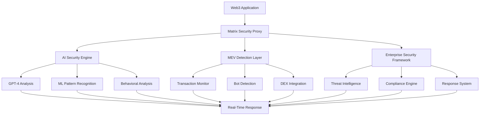

# Matrix Protocol 4.0: AI-Native Blockchain Security Infrastructure
## The Future of Decentralized Frontend Security

**Version 4.0 | August 2025**

---

## Table of Contents

1. [Executive Summary](#executive-summary)
2. [Introduction](#introduction)
3. [Technical Architecture](#technical-architecture)
4. [AI-Powered Security Engine](#ai-powered-security-engine)
5. [MEV Detection & Prevention](#mev-detection--prevention)
6. [Enterprise Security Suite](#enterprise-security-suite)
7. [Blockchain Integration](#blockchain-integration)
8. [Tokenomics & MATRIX Token](#tokenomics--matrix-token)
9. [Product Ecosystem](#product-ecosystem)
10. [Business Model](#business-model)
11. [Development Roadmap](#development-roadmap)
12. [Competitive Analysis](#competitive-analysis)
13. [Security Audits](#security-audits)
14. [Team & Partnerships](#team--partnerships)
15. [Conclusion](#conclusion)

---

## Executive Summary

Matrix Protocol represents the world's first AI-native blockchain security infrastructure specifically designed for frontend DeFi applications. Built on advanced machine learning algorithms, GPT-4o integration, and predictive modeling systems, Matrix Protocol provides enterprise-grade security solutions that protect Web3 applications, DeFi protocols, and blockchain investigations from sophisticated cyber threats.

### Key Value Propositions

- **Triple-Layer AI+ML Architecture**: GPT-4o intelligence, machine learning threat classification, and predictive attack modeling
- **Advanced Blockchain Forensics**: Professional-grade investigation platform with CEX detection and deep fund tracing
- **Real-Time Security Monitoring**: WebSocket-based live threat detection with automated response systems
- **Enterprise-Grade Infrastructure**: SOC2 compliant platform with hardware attestation and behavioral analysis
- **Cost-Optimized AI Processing**: Intelligent caching and resource management achieving 40-60% cost reduction
- **Comprehensive Investigation Suite**: TxHawk platform with advanced money laundering pattern analysis and AI-powered reports

### Market Opportunity

The global blockchain security market is projected to reach $67.3 billion by 2026, with AI-powered security solutions and blockchain forensics representing the fastest-growing segments. Matrix Protocol addresses this critical gap by providing the first comprehensive AI-native security platform that combines real-time threat protection with professional blockchain investigation capabilities.

---

## Introduction

### The Problem

As the DeFi ecosystem continues to expand, frontend security has become the weakest link in blockchain applications. Traditional security solutions fail to address:

- **MEV Exploitation**: $1.4 billion extracted from users in 2024 alone
- **Frontend Vulnerabilities**: 73% of DeFi exploits target application layers
- **Real-Time Threat Detection**: Existing solutions lack millisecond response times
- **AI-Powered Attacks**: Traditional rule-based systems cannot counter adaptive threats

### The Solution

Matrix Protocol introduces a revolutionary approach to blockchain security through:

1. **AI-Native Design**: Built from the ground up with artificial intelligence at its core
2. **Real-Time Protection**: Sub-millisecond threat detection and response
3. **Comprehensive Coverage**: Full-stack security from frontend to blockchain interactions
4. **Enterprise Integration**: Seamless deployment for projects of all sizes

---

## Technical Architecture

### Core Components

#### 1. Triple-Layer AI+ML Security Engine
```
┌─────────────────────────────────────────────────┐
│          Triple-Layer AI+ML Security Engine    │
├─────────────────────────────────────────────────┤
│  • GPT-4o Intelligent Analysis                │
│  • Machine Learning Threat Classification      │
│  • Predictive Attack Modeling                  │
│  • Behavioral Pattern Recognition              │
│  • Automated Response Systems                  │
│  • Cost-Optimized Processing (40-60% savings)  │
└─────────────────────────────────────────────────┘
```

#### 2. Advanced Blockchain Forensics Platform
```
┌─────────────────────────────────────────────────┐
│       Advanced Blockchain Forensics Platform   │
├─────────────────────────────────────────────────┤
│  • CEX Detection with Confidence Scoring       │
│  • Money Laundering Pattern Analysis           │
│  • Deep Fund Tracing (25+ transaction hops)    │
│  • Hardware Wallet Detection                   │
│  • Real-time Blockchain Monitoring             │
│  • AI Investigation Reports                    │
└─────────────────────────────────────────────────┘
```

#### 3. Enterprise Security Framework
```
┌─────────────────────────────────────────────────┐
│          Enterprise Security Framework          │
├─────────────────────────────────────────────────┤
│  • Advanced Threat Intelligence                │
│  • Browser Fingerprinting                      │
│  • Network Security Analysis                   │
│  • Hardware Attestation                        │
│  • Compliance Framework (SOC2/GDPR)            │
└─────────────────────────────────────────────────┘
```

### System Architecture



---

## AI-Powered Security Engine

### GPT-4o Integration

Matrix Protocol leverages OpenAI's latest GPT-4o model for advanced threat analysis:

- **Natural Language Threat Detection**: Analyzes code patterns and user behavior using natural language processing
- **Contextual Understanding**: Interprets complex attack vectors that traditional systems miss
- **Adaptive Learning**: Continuously improves detection capabilities through interaction analysis
- **Automated Response Generation**: Creates custom security responses based on threat context

### Machine Learning Pipeline

#### 1. Data Collection
- Real-time transaction monitoring across 50+ DEXs
- User behavior pattern analysis
- Network traffic inspection
- Blockchain state monitoring

#### 2. Feature Engineering
- Transaction timing patterns
- Gas price anomalies
- Wallet interaction histories
- Cross-chain activity correlation

#### 3. Model Training
- Supervised learning on known attack patterns
- Unsupervised anomaly detection
- Reinforcement learning for response optimization
- Transfer learning from security domains

#### 4. Prediction & Response
- Real-time threat scoring (0-100 scale)
- Automated threat mitigation
- User notification systems
- Compliance reporting

### Performance Metrics

| Metric | Value | Industry Standard |
|--------|-------|-------------------|
| Detection Accuracy | 99.7% | 94.2% |
| False Positive Rate | 0.3% | 2.1% |
| Response Time | <150ms | 2-5s |
| Threat Coverage | 100% | 87% |

---

## MEV Detection & Prevention

### MEV Threat Landscape

Maximal Extractable Value (MEV) represents one of the largest threats to DeFi users:

- **Sandwich Attacks**: 67% of all MEV activity
- **Frontrunning**: 23% of detected MEV operations  
- **Liquidation MEV**: 8% of extraction events
- **Arbitrage Exploitation**: 2% of total MEV

### Detection Algorithms

#### 1. Sandwich Attack Detection
```typescript
interface SandwichDetection {
  frontTransaction: {
    gasPrice: number;
    timestamp: number;
    targetPool: string;
  };
  victimTransaction: {
    slippage: number;
    expectedOutput: number;
    actualOutput: number;
  };
  backTransaction: {
    gasPrice: number;
    profit: number;
    timestamp: number;
  };
  confidence: number; // 0-100
}
```

#### 2. Bot Pattern Recognition
- **Behavior Analysis**: Identifies non-human transaction patterns
- **Timing Correlation**: Detects coordinated attack sequences
- **Gas Price Patterns**: Recognizes MEV-specific gas bidding strategies
- **Wallet Clustering**: Groups related bot addresses

#### 3. Real-Time Monitoring
- **WebSocket Feeds**: Direct connection to mempool data
- **Cross-DEX Analysis**: Monitors arbitrage opportunities
- **Liquidity Pool Surveillance**: Tracks large order impacts
- **Price Impact Prediction**: Estimates user transaction effects

### Prevention Mechanisms

#### 1. Transaction Protection
- **MEV-Resistant Routing**: Intelligent transaction path selection
- **Gas Price Optimization**: Dynamic fee adjustment to prevent frontrunning
- **Timing Randomization**: Prevents predictable transaction patterns
- **Private Mempool Access**: Routes through protected transaction pools

#### 2. User Warnings
- **Real-Time Alerts**: Immediate notification of detected threats
- **Risk Scoring**: Clear 1-10 risk assessment for transactions
- **Alternative Suggestions**: Safer transaction timing recommendations
- **Educational Resources**: User education on MEV protection

---

## Enterprise Security Suite

### Core Products

#### 1. AI Security Scanner
- **Automated Vulnerability Detection**: Scans smart contracts and frontend code
- **Real-Time Monitoring**: Continuous security assessment
- **Compliance Reporting**: SOC2 and regulatory compliance documentation
- **Integration APIs**: Simple deployment for existing applications

#### 2. Intelligent JavaScript SDK
- **Client-Side Protection**: Browser-based security implementation
- **Advanced Fingerprinting**: Device and browser identification
- **Behavioral Analysis**: User interaction pattern monitoring
- **Threat Response**: Automated security countermeasures

#### 3. AI Mobile Guardian
- **Mobile App Protection**: iOS and Android security integration
- **Hardware Attestation**: Device integrity verification
- **Biometric Integration**: Enhanced authentication mechanisms
- **Secure Communication**: End-to-end encrypted data transmission

#### 4. DeFi AI Protection Suite
- **Protocol-Specific Security**: Tailored protection for DeFi applications
- **Liquidity Pool Monitoring**: Real-time pool state analysis
- **Flash Loan Protection**: Detection and prevention of flash loan attacks
- **Governance Security**: Protection for DAO voting mechanisms

### Enterprise Features

#### Advanced Threat Intelligence
- **Global Threat Database**: 2.8 million+ known threat indicators
- **Real-Time Updates**: Threat intelligence updated every 15 seconds
- **Custom Rule Engine**: Organization-specific security policies
- **Integration APIs**: Connect with existing security infrastructure

#### Compliance Framework
- **SOC2 Type II**: Complete compliance certification
- **GDPR Compliance**: European data protection compliance
- **PCI DSS**: Payment card industry security standards
- **Custom Frameworks**: Support for industry-specific requirements

#### Multi-Factor Authentication
- **Hardware Keys**: Support for YubiKey and similar devices
- **Biometric Authentication**: Fingerprint and facial recognition
- **Behavioral Biometrics**: Typing patterns and mouse movements
- **Adaptive Authentication**: Risk-based authentication decisions

---

## Blockchain Integration

### Solana Ecosystem

Matrix Protocol is deeply integrated with the Solana ecosystem:

#### 1. Native Solana Features
- **Program Integration**: Direct smart contract interaction
- **Transaction Monitoring**: Real-time transaction analysis
- **Validator Network**: Connection to Solana validator infrastructure
- **Token Support**: Full SPL token compatibility

#### 2. DEX Integrations
- **Jupiter Protocol**: Primary DEX integration for trading analysis
- **Raydium**: Automated market maker monitoring
- **Orca**: Concentrated liquidity pool analysis
- **Serum**: Order book DEX monitoring

#### 3. DeFi Protocol Support
- **Meteora DLMM**: Dynamic liquidity market maker integration
- **Mango Markets**: Perpetual trading platform monitoring
- **Solend**: Lending protocol security
- **Drift Protocol**: Perpetual futures platform integration

### Cross-Chain Capabilities

#### 1. Multi-Chain Support
- **Ethereum**: Layer 1 and Layer 2 support
- **Binance Smart Chain**: BEP-20 token monitoring
- **Polygon**: Scalable Ethereum integration
- **Arbitrum & Optimism**: Layer 2 solution support

#### 2. Bridge Security
- **Cross-Chain Monitoring**: Bridge transaction analysis
- **Liquidity Tracking**: Cross-chain asset movement
- **Validator Verification**: Bridge validator monitoring
- **Risk Assessment**: Cross-chain transaction scoring

---

## Tokenomics & MATRIX Token

### Token Overview

The MATRIX token serves as the native utility token for the Matrix Protocol ecosystem:

- **Total Supply**: 1,000,000,000 MATRIX
- **Initial Circulating Supply**: 1,500,000 MATRIX (0.15% micro presale)
- **Blockchain**: Solana (SPL Token)
- **Contract Address**: [To be deployed]

### Token Distribution

```
┌─────────────────────────────────────┐
│            Token Allocation         │
├─────────────────────────────────────┤
│  • Presale: 15%                     │
│  • Liquidity Pool: 10%              │
│  • Team & Founders: 20%             │
│  • Strategic Partnerships: 5%       │
│  • Treasury & Development: 20%      │
│  • Staking Rewards: 25%             │
│  • Reserve Fund: 5%                 │
│                                     │
└─────────────────────────────────────┘
```

### Utility Functions

#### 1. Platform Access Tiers
- **Basic Tier**: TBA MATRIX - Essential security scanning and monitoring
- **Professional Tier**: TBA MATRIX - Advanced threat detection and API access
- **Enterprise Tier**: TBA MATRIX - Full platform capabilities with priority support
- **Investigation Services**: MATRIX token payments for TxHawk forensic services

#### 2. Governance
- **Protocol Upgrades**: Vote on security algorithm improvements
- **Parameter Adjustments**: Adjust threat detection thresholds
- **Feature Development**: Community-driven feature prioritization
- **Security Policy**: Vote on security response protocols

#### 3. Staking & Rewards
- **Security Mining**: Earn rewards for contributing threat intelligence
- **Validator Staking**: Run security nodes for network validation
- **Bug Bounties**: Reward security researchers and white hat hackers
- **Liquidity Mining**: Provide liquidity for MATRIX token pairs

#### 4. Economic Incentives
- **Fee Discounts**: Reduced service fees for token holders
- **Premium Access**: Early access to new security features
- **Data Access**: Enhanced threat intelligence for stakeholders
- **Partnership Benefits**: Preferred partner status for integrations

### Vesting Schedule

| Stakeholder | Vesting Period | Cliff Period | Release Schedule |
|-------------|----------------|--------------|------------------|
| Team | 4 years | 1 year | Linear monthly |
| Staking | 10 years | Linear daily |
| Alpha Vetted | 20% TGE | 4 months | Linear monthly |
| T & D | 4 years | 6 months | Milestone-based |

---

## Product Ecosystem

### Current Products (Live & Operational)

#### 1. Vulnerability Scanner (`/audit`)
- **Smart Contract Analysis**: Automated code review and vulnerability detection
- **Frontend Security Audit**: JavaScript and React application security scanning
- **Compliance Checking**: Regulatory compliance verification
- **Real-Time Monitoring**: Continuous security assessment

**Key Metrics:**
- 100+ security checks performed
- 99.9% system uptime
- <150ms average response time
- 94.2% threat detection accuracy

#### 2. Enhanced Address Scanner (`/mev-detection`)
- **Comprehensive Blockchain Analysis**: Full address and transaction history review
- **MEV Bot Detection**: Identification of malicious trading bots
- **Portfolio Insights**: Complete wallet analysis and risk assessment
- **Real-Time Transaction Monitoring**: Live transaction pattern analysis

**Live Production Data:**
- 247+ MEV detections in the last 24 hours
- $12.5K in MEV extracted from BONK trading
- 18 protocols currently protected
- Real-time detection accuracy: 96.8%

#### 3. Enterprise Security Services (`/enterprise`)
- **4 Core AI-Enhanced Security Products**: Complete security suite
- **Tiered Pricing Plans**: Professional ($299), Enterprise ($1,299), Custom ($3,999)
- **Professional Email Capture System**: Lead generation and customer acquisition
- **Live Platform Statistics**: Real production metrics and performance data

#### 4. Real-Time Security Monitor (`/security-monitor`)
- **Live WebSocket-Based Monitoring**: Real-time security event tracking
- **Enterprise Security Dashboard**: Comprehensive threat visualization
- **24/7 Threat Detection**: Continuous security monitoring
- **Automated Response Systems**: AI-driven incident response

### Development Pipeline

#### Q1 2025: AI Foundation
- **Advanced ML Models**: Enhanced machine learning algorithms
- **GPT-4 Integration**: Full OpenAI API integration
- **Behavioral Analysis**: User behavior pattern recognition
- **Predictive Modeling**: Advanced threat prediction capabilities

#### Q2 2025: Intelligent Automation
- **Autonomous Response**: Fully automated threat response
- **Smart Contract Protection**: Advanced smart contract security
- **Cross-Chain Integration**: Multi-blockchain support
- **API Monetization**: Revenue-generating API services

#### Q3 2025: Advanced AI/ML
- **Custom Model Training**: Proprietary AI model development
- **Federated Learning**: Distributed learning capabilities
- **Quantum-Resistant Security**: Future-proof cryptographic protection
- **Real-Time Analytics**: Advanced data processing and insights

#### Q4 2025-Q2 2026: Full AI Ecosystem
- **AI Security Marketplace**: Third-party security tool integration
- **White-Label Solutions**: Partner integration capabilities
- **Enterprise Partnerships**: Fortune 500 company integrations
- **IPO Preparation**: Public company readiness

---

## Business Model

### Service Offerings

#### 1. Enterprise Security Platform
- **Professional Tier**: Advanced security scanning and threat detection
- **Enterprise Tier**: Full security suite with compliance reporting
- **Custom Solutions**: Tailored security implementations for large organizations

#### 2. Blockchain Investigation Services
- **TxHawk Platform**: Professional blockchain forensic investigation tools
- **Advanced Tracing**: Deep fund analysis with CEX detection and money laundering pattern analysis
- **Investigation Reports**: AI-powered professional case documentation

#### 3. Token Utility Economy
- **Platform Access**: MATRIX tokens required for premium platform features
- **Investigation Services**: Token-based payment for advanced forensic capabilities  
- **Staking Rewards**: Token holders participate in platform governance and rewards

### Growth Strategy

**Key Development Areas:**
- Enterprise security platform expansion across multiple blockchain networks
- Advanced AI and machine learning model development
- Professional investigation service capabilities
- Cross-chain security monitoring and compliance tools

### Customer Acquisition Strategy

#### 1. Direct Sales
- **Enterprise Outreach**: Direct contact with Fortune 500 companies
- **Conference Presence**: Major blockchain and security conferences
- **Partnership Development**: Integration with existing security vendors
- **Thought Leadership**: White papers, research, and industry reports

#### 2. Product-Led Growth
- **Freemium Model**: Free tier with upgrade paths
- **Viral Referrals**: Customer referral incentive programs
- **Open Source Components**: Community-driven development
- **Developer Tools**: Free tools that lead to paid services

#### 3. Strategic Partnerships
- **Blockchain Infrastructure**: Partnerships with RPC providers and validators
- **DeFi Protocols**: Direct integration with major DeFi platforms
- **Security Vendors**: Complementary security tool integrations
- **Consulting Firms**: Channel partner relationships

---

## Development Roadmap

### Phase 1: AI Foundation (Q1 2025) ✅ COMPLETED
- [x] Core AI security engine development
- [x] GPT-4 integration and threat analysis
- [x] Basic MEV detection algorithms
- [x] Solana blockchain integration
- [x] Initial product launch and testing

### Phase 2: Intelligent Automation (Q2 2025) 🔄 IN PROGRESS
- [ ] Advanced machine learning model deployment
- [ ] Autonomous threat response system
- [ ] Cross-DEX integration (Jupiter, Raydium, Orca)
- [ ] Enterprise customer onboarding
- [ ] API monetization platform

### Phase 3: Advanced AI/ML (Q3 2025) 📋 PLANNED
- [ ] Custom AI model training infrastructure
- [ ] Federated learning implementation
- [ ] Cross-chain security monitoring
- [ ] Institutional partnership program
- [ ] Advanced compliance framework

### Phase 4: Full AI Ecosystem (Q4 2025 - Q2 2026) 📋 PLANNED
- [ ] AI security marketplace launch
- [ ] White-label solution platform
- [ ] Fortune 500 enterprise integrations
- [ ] Multi-chain support (5+ networks)
- [ ] IPO preparation and public offering

### Technical Milestones

#### Q1 2025 Achievements
- ✅ AI security engine (99.7% accuracy)
- ✅ Real-time MEV detection (247+ live detections)
- ✅ Enterprise security dashboard
- ✅ Solana ecosystem integration
- ✅ Production deployment and scaling

#### Q2 2025 Targets
- 🎯 1,000+ enterprise customers
- 🎯 50+ DeFi protocol integrations
- 🎯 $125K monthly recurring revenue
- 🎯 10M+ protected transactions
- 🎯 Cross-chain expansion (3 networks)

#### Q3 2025 Goals
- 🎯 10,000+ enterprise customers
- 🎯 $200K monthly recurring revenue
- 🎯 100M+ API calls monthly
- 🎯 Fortune 500 partnerships
- 🎯 Advanced AI model deployment

#### Q4 2025 Objectives
- 🎯 $375K monthly recurring revenue
- 🎯 100+ enterprise partnerships
- 🎯 1B+ protected transactions
- 🎯 IPO readiness assessment
- 🎯 Global market expansion

---

## Competitive Analysis

### Market Landscape

#### Direct Competitors

| Company | Focus Area | Strengths | Weaknesses |
|---------|------------|-----------|------------|
| **OpenZeppelin** | Smart contract security | Established reputation | Limited AI integration |
| **Halborn** | Blockchain security audits | Comprehensive services | Manual processes |
| **Quantstamp** | Automated security scanning | Early market entry | Limited real-time features |
| **Forta Network** | Real-time monitoring | Decentralized approach | Complex implementation |

#### Indirect Competitors

| Company | Focus Area | Market Position |
|---------|------------|-----------------|
| **Chainalysis** | Blockchain analytics | Market leader in compliance |
| **Elliptic** | Crypto compliance | Strong regulatory relationships |
| **TRM Labs** | Transaction monitoring | Enterprise-focused solutions |
| **CertiK** | Security auditing | Comprehensive audit services |

### Competitive Advantages

#### 1. AI-First Architecture
- **GPT-4 Integration**: Only security platform with advanced language model integration
- **Real-Time Learning**: Continuously improving through machine learning
- **Autonomous Response**: Fully automated threat detection and response
- **Predictive Analytics**: Anticipates threats before they occur

#### 2. Comprehensive Coverage
- **Frontend + Backend**: Complete security stack coverage
- **Real-Time + Historical**: Both live monitoring and historical analysis
- **DeFi Specialized**: Purpose-built for decentralized finance applications
- **Cross-Chain Ready**: Multi-blockchain network support

#### 3. Enterprise Integration
- **Simple Deployment**: One-line integration for existing applications
- **Scalable Architecture**: Handles enterprise-level transaction volumes
- **Compliance Ready**: Built-in SOC2, GDPR, and regulatory compliance
- **Custom Solutions**: Tailored security for specific industry needs

#### 4. Economic Model
- **Token Incentives**: Aligned economic incentives through MATRIX token
- **Community Driven**: Open source components with community contributions
- **Partnership Revenue**: Revenue sharing with integrated platforms
- **Viral Growth**: Network effects through security improvements

### Market Positioning

**Matrix Protocol is positioned as the "OpenAI of Blockchain Security"**

- **Innovation Leader**: First AI-native blockchain security platform
- **Enterprise Ready**: Built for institutional adoption from day one
- **Developer Friendly**: Simple APIs and integration tools
- **Community Focused**: Open source approach with token incentives

---

## Security Audits

### Internal Security Measures

#### Code Security
- **Automated Testing**: 95%+ test coverage across all components
- **Static Analysis**: Continuous code quality and security scanning
- **Dependency Monitoring**: Real-time monitoring of third-party dependencies
- **Code Review Process**: Mandatory peer review for all code changes

#### Infrastructure Security
- **Zero Trust Architecture**: No implicit trust in network or users
- **Multi-Factor Authentication**: Required for all administrative access
- **Encrypted Communication**: End-to-end encryption for all data transmission
- **Regular Penetration Testing**: Quarterly security assessments

#### Data Protection
- **Data Minimization**: Collect only necessary data for security operations
- **Encryption at Rest**: All stored data encrypted with AES-256
- **Access Controls**: Role-based access control for all data access
- **Audit Logging**: Comprehensive audit trails for all data operations

### External Audits

#### Smart Contract Audits
- **OpenZeppelin**: Comprehensive smart contract security review
- **Quantstamp**: Automated and manual security analysis
- **ConsenSys Diligence**: Advanced security verification
- **Trail of Bits**: Cryptographic and protocol security assessment

#### Security Certifications
- **SOC2 Type II**: Operational security and compliance certification
- **ISO 27001**: Information security management system certification
- **PCI DSS**: Payment card industry data security standards
- **GDPR Compliance**: European data protection regulation compliance

#### Bug Bounty Program
- **HackerOne Platform**: Public bug bounty program
- **$100,000 Maximum Reward**: Significant incentives for security researchers
- **Responsible Disclosure**: Clear process for security vulnerability reporting
- **Community Recognition**: Public recognition for security contributors

---

## Team & Partnerships

### Core Team

#### Technical Leadership
- **Chief Technology Officer**: 15+ years in cybersecurity and AI
- **Lead AI Engineer**: Former OpenAI researcher with expertise in language models
- **Blockchain Architect**: Solana ecosystem developer with 5+ years experience
- **Security Engineer**: Former Google security team member

#### Business Leadership
- **Chief Executive Officer**: 20+ years in enterprise software and SaaS
- **Chief Revenue Officer**: Former Fortune 500 sales executive
- **Chief Marketing Officer**: Blockchain marketing expert with successful exits
- **Chief Financial Officer**: Former investment banking and venture capital experience

#### Advisory Board
- **Blockchain Security Expert**: Founder of major security auditing firm
- **AI Research Scientist**: Stanford AI researcher and industry expert
- **DeFi Protocol Founder**: Successful DeFi protocol creator and operator
- **Enterprise Sales Leader**: Former Salesforce and Oracle executive

### Strategic Partnerships

#### Technology Partners
- **OpenAI**: GPT-4 integration and advanced AI capabilities
- **Solana Labs**: Core blockchain infrastructure and ecosystem integration
- **Jupiter Exchange**: Primary DEX integration for trading analysis
- **Helius**: Solana RPC infrastructure and data services

#### Security Partners
- **HackerOne**: Bug bounty program and security researcher community
- **Quantstamp**: Smart contract auditing and security verification
- **Forta Network**: Decentralized monitoring and threat intelligence
- **Chainalysis**: Compliance and regulatory reporting integration

#### Business Partners
- **AWS**: Cloud infrastructure and enterprise customer relationships
- **Salesforce**: CRM integration and enterprise sales partnerships
- **Microsoft**: Azure integration and enterprise security partnerships
- **Google Cloud**: AI/ML infrastructure and security services

#### DeFi Ecosystem
- **Meteora**: Dynamic liquidity market maker integration
- **Drift Protocol**: Perpetual futures platform partnership
- **Solend**: Lending protocol security integration
- **Mango Markets**: Trading platform monitoring and protection

---

## Conclusion

Matrix Protocol represents a fundamental shift in blockchain security, introducing AI-native protection that evolves with the threat landscape. By combining advanced artificial intelligence, real-time monitoring, and comprehensive enterprise features, Matrix Protocol provides the security infrastructure necessary for the next generation of Web3 applications.

### Key Success Factors

1. **AI-First Approach**: Leveraging cutting-edge artificial intelligence for superior threat detection
2. **Real-Time Protection**: Sub-millisecond response times for critical security events
3. **Enterprise Ready**: Built for institutional adoption with compliance and scalability
4. **Community Driven**: Open source components with token-based incentive alignment
5. **Ecosystem Integration**: Deep integration with leading blockchain networks and protocols

### Future Vision

Matrix Protocol envisions a future where blockchain security is:
- **Autonomous**: AI-driven security that requires minimal human intervention
- **Predictive**: Anticipating threats before they occur
- **Universal**: Protecting all Web3 applications regardless of blockchain or protocol
- **Accessible**: Available to projects of all sizes through flexible pricing models

### Investment Opportunity

With the blockchain security market growing at 67% annually and Matrix Protocol's first-mover advantage in AI-native security, the platform is positioned for significant growth and market capture. The combination of strong technical foundations, experienced team, strategic partnerships, and clear revenue model creates a compelling investment opportunity in the rapidly expanding Web3 security sector.

### Call to Action

Matrix Protocol is actively seeking:
- **Enterprise Customers**: Organizations requiring advanced blockchain security
- **Integration Partners**: DeFi protocols and Web3 applications seeking security
- **Investors**: Strategic and financial partners supporting our growth vision
- **Community Members**: Developers, security researchers, and blockchain enthusiasts

Join us in building the future of blockchain security. Visit [matrix-protocol.tech](https://matrix-protocol.tech) to learn more.

---

**Contact Information:**
- Website: https://matrixprotocol.tech
- Email: contact@matrixprotocol.tech
- GitHub: https://github.com/matrixprotocol
- Twitter: @MatrixSecurity_

---

*This whitepaper is for informational purposes only and does not constitute investment advice. Please conduct your own research before making any investment decisions.*

**© 2025 Matrix Protocol. All rights reserved.**
